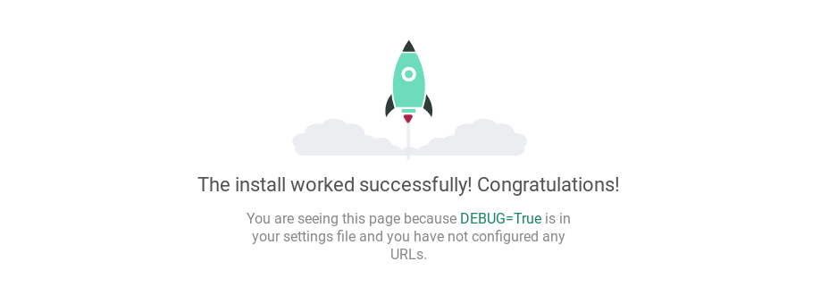
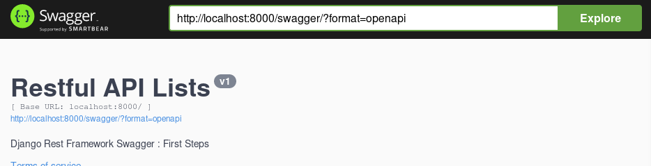

# Django REST Framework Tutorials 1
# What's this?
Djangoで詰まって開発できねえ！というDjango初心者向けのFirst StepsとTips

# Requirement
- Python > 3.6
- Mac or Linux (recommend)

#  venv 環境を作成する
ホストの環境を汚さないためにはPythonの仮想環境である venv を利用することが恐らく最も簡単な手段の一つです。

```shell
mkdir <project-name> # ex. example_django_rest_api
cd <project-name>
python -m venv venv
source venv/bin/activate
```

すると terminal での表示が、

"~$" -> "[venv] ~$" のようになります。逆に言えばこうなっていないと venv の環境に入れていません。

# まずはプロジェクトを立ち上げる
## パッケージのインストール & 確認
venv 環境内で、まず今回扱うプロジェクトのための依存パッケージのインストールを行います。

```shell
pip install Django django-livesync drf_yasg djangorestframework uWSGI packaging
```

インストールしたパッケージを確認しましょう。

```shell
pip freeze
```

```shell
$ pip freeze
# ...
# Django==2.2.4
# django-livesync==0.4
# djangorestframework==3.10.2
# ...
```

今後のために、インストールしたパッケージ一覧を保存しておきましょう。

```shell
$ pip freeze > requirement.txt
```

現在までのフォルダ構成は次のようになっています。

```
. example_django_rest_api
├── db.sqlite3
├── example_django_rest_api
│   ├── __init__.py
│   ├── __pycache__
│   │   └── ...
│   ├── settings.py
│   ├── urls.py
│   └── wsgi.py
├── manage.py
├── venv
│   └── ...
└── requirement.txt
```

お疲れ様です。もう少し頑張ったら小休憩を挟みましょう。
## Hello Django !
以下のコマンドを使うことで、プロジェクトを立ち上げることができます。

最後の "." を忘れないようにしてください。

```shell
$ django-admin startproject example_django_rest_api .
$ python manage.py runserver
```

お使いのブラウザで `http://localhost:8000`へアクセスしてください。次のような画面が見えるはずです。




**Django 使ってみた！** みたいな、いいねが1000件くらいついている記事でよく見るアレです。
## Hello Swagger via Django !
いくつかのファイルを編集することで Swagger への扉が開かれます。ついでに livereload 等の設定もしましょう。

まず `settings.py` を編集します。

```python
# add '*' into a list
ALLOWED_HOSTS = ['*']

# add some elements into a list
INSTALLED_APPS = [
    'django.contrib.admin',
    'django.contrib.auth',
    'django.contrib.contenttypes',
    'django.contrib.sessions',
    'django.contrib.messages',
    'django.contrib.staticfiles',
    # add below elements
    'livesync',
    'rest_framework',
]

# add below lines
MIDDLEWARE_CLASSES = (
    'livesync.core.middleware.DjangoLiveSyncMiddleware',
)
```

次に `urls.py` を編集します。

TODO
```python
from django.contrib import admin
from django.urls import path

# add below lines
from django.conf.urls import url

from rest_framework import permissions
from drf_yasg.views import get_schema_view
from drf_yasg import openapi

schema_view = get_schema_view(
   openapi.Info(
      title="RESTful API Lists",
      default_version='v1',
      description="Django Rest Framework Swagger : First Steps",
      terms_of_service="https://github.com/MokkeMeguru",
      contact=openapi.Contact(email="meguru.mokke@gmail.com"),
      license=openapi.License(name="MIT"),
   ),
   public=True,
   permission_classes=(permissions.AllowAny,),
)

# add some elements into the list
urlpatterns = [
    path('admin/', admin.site.urls),
    # url(r'^swagger(?P<format>\.json|\.yaml)$', schema_view.without_ui(cache_timeout=0), name='schema-json'),
   url(r'^swagger/$', schema_view.with_ui('swagger', cache_timeout=0), name='schema-swagger-ui'),
    url(r'^redoc/$', schema_view.with_ui('redoc', cache_timeout=0), name='schema-redoc'),
]
```

編集が終わったら、`http://localhost:8000/swagger` へアクセスしてみましょう。swagger 界隈おなじみの画面が見られると思います。APIを試して見るときにはこれが非常に便利だと思います(次回以降紹介します)。



`http://localhost:8000/redoc` は API のドキュメント的なものが見れるようになっています。興味があればアクセスして見てください。

以上で今回のチュートリアルは終了です。コーヒーでも飲んでリラックスしましょう。
# Tips
## django-rest-swagger の廃止
この [issue](https://github.com/marcgibbons/django-rest-swagger/issues/808) からわかるように、django-rest-swagger はオワコンになりました。

代わりに [drf-yasg](https://github.com/axnsan12/drf-yasg#quickstart) を使いましょう。
## PyMySQL の Django 非対応について
どうやら Django は PyMySQL の対応をしたくないらしいです。少なくとも Django 2.2.1 では対応していなかったです。https://docs.djangoproject.com/en/2.2/releases/2.2/ からもわかるように mysqlclient 推しの模様。

同機能のライブラリを乱立させないで欲しい（切実）
## venv 環境ってOOO(エディタ名) でどう入るの？
"OOO venv python" あたりで調べてください。 それでわからなければ、あなたにそのエディタは合わないんじゃないですかね。

## `pip install -r requirement.txt`
依存パッケージを保存したファイルからパッケージインストールを行う方法。

# TODO
## `pip install mysqlclient` の実行
mysqlclient はその実行環境下で mysql のインストールが必要なのでローカルで確認する際には邪魔

## OpenAPIスキーマ生成 への対応
`settings.py` から以下の項目を削除 (https://www.django-rest-framework.org/community/3.10-announcement/)

```python
REST_FRAMEWORK = {
    'DEFAULT_SCHEMA_CLASS': 'rest_framework.schemas.coreapi.AutoSchema'
}
```

# backlog

この状態のデータは、このレポジトリの release v0.1.1 にあります。
