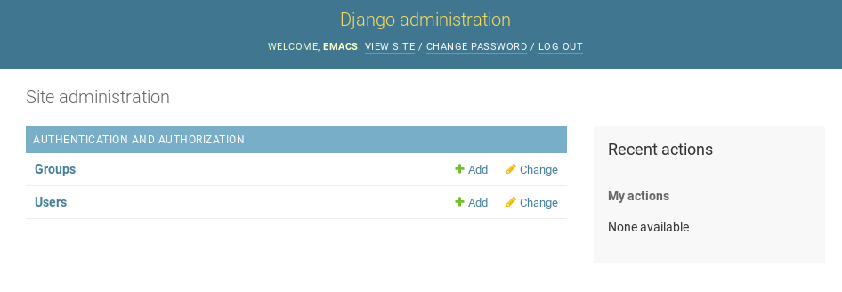
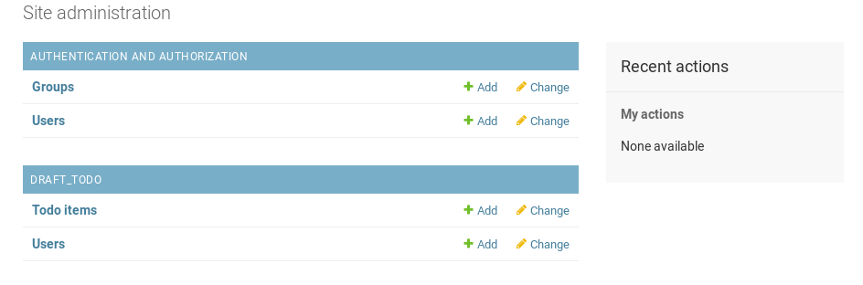
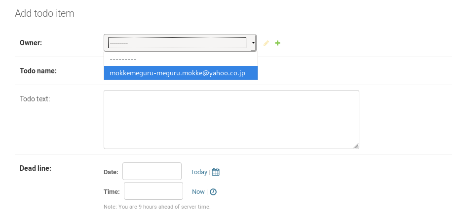
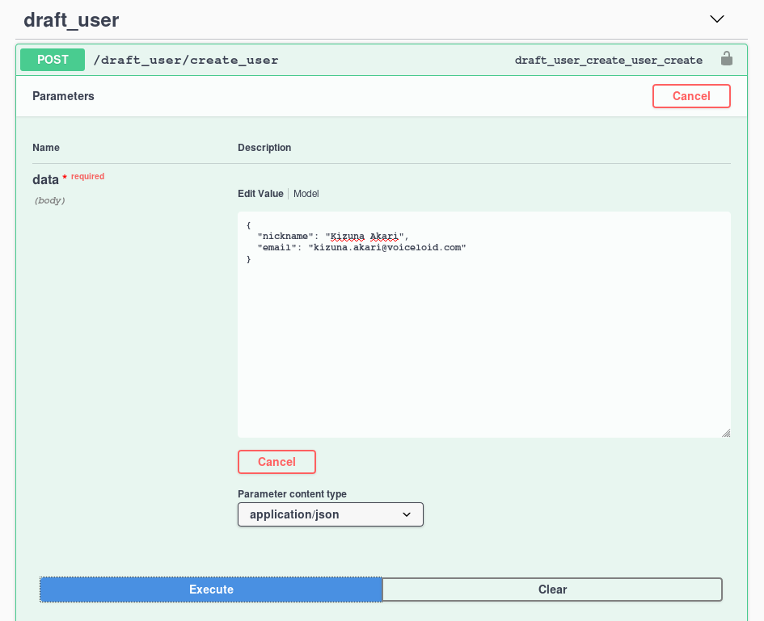
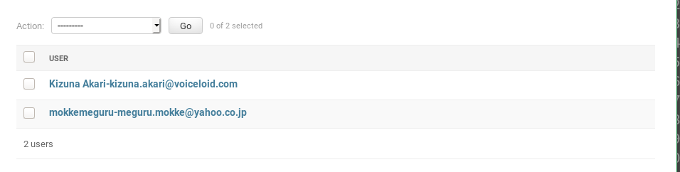

# Django REST Framework Tutorials 3
# Requirement
- Python > 3.6
- Mac or Linux (recommend)
- SQLite3

# Modelを使ってDjango風APIを作る
これからやることはDjangoが大得意なデータベッタベタなAPIの作成です。

なので前回の Ping-Pong に比べればかなり楽な作業になると思います。端っこにYoutubeの動画でも流してさらっと終わらせましょう。

# migrate してみる
Django は標準で SQLite3 を用いたデータベースを提供します。これはほぼゼロコストで試すことができるんど絵、開発のスタート時点ではこのデータベースのまま進めてしまうのも選択肢の一つとして上げることができるでしょう。

```shell
python migrate.py migrate
```

これだけです。というよりこれ以上のことをしようとするとかなりドキュメントを読まないといけないので、 *今はここで我慢してください*。

# app を作る
前回と同じです。

```shell
django-admin startapp draft_todo
```

ここでできたフォルダの階層を再確認します。

```text
.
├── db.sqlite3
├── draft_todo
│   ├── admin.py
│   ├── apps.py
│   ├── __init__.py
│   ├── migrations
│   │   └── __init__.py
│   ├── models.py
│   ├── tests.py
│   └── views.py
├── example_django_rest_api
│   └── ...
├── manage.py
├── ping_pong
│   └── ...
└── requirement.txt
```

# モデルを作る
今回はデータベッタベタなAPIなのでまずモデルから作ります。というかDjangoではこうするのが正規ルートっぽいです。

`draft_todo/models.py` を編集しましょう。

```python
from django.db import models
from django.core.validators import MinLengthValidator

# Create your models here.
class User(models.Model):
    nickname = models.CharField(max_length=30, validators=[MinLengthValidator(5)], unique=True)
    email = models.EmailField()

    def __str__(self):
        return "{}-{}".format(self.nickname, self.email)

class TodoItem(models.Model):
    owner = models.ForeignKey(User, on_delete=models.CASCADE)
    todo_name = models.CharField(max_length=100)
    todo_text = models.TextField(blank=True, null=True)
    dead_line = models.DateTimeField()
    raise_date = models.DateTimeField(auto_now_add=True)
    importance = models.IntegerField(null=True)
    close_date = models.DateTimeField(blank=True, null=True)
    def __str__(self):
        return "{}-{}".format(self.owner, self.todo_name)

    class Meta:
        ordering = ('dead_line', 'raise_date')
```

基本的にはSQLをPython っぽく書けば良いだけです。ただし models.Model を継承する必要があります。

User は ユーザ名とメールアドレスを保存するためのテーブルです。ユーザ名は unique にしたかったので、引数に unique=True 制約を加えています。

XXField って何？って思うかもしれませんが、名前からなんとかなくXXのためのフィールドなんだなって思ってください。たくさん種類があるので、定義ジャンプやドキュメントから自分の使いたいものを探すと良いでしょう。


TodoItem は owner がユーザに対して many to one な関係です。なので、models.ForeignKey を使ってつなげています。 `on_delete = models.CASCADE` はユーザが消えたときの処理で、今回は関連する TodoItem をすべて消します。


# モデルをマイグレートする
DjangoのDjangoな点は、モデルがそのままデータベースにぶっ飛んでいくところです。

まず `settings.py` に加筆します。

```python
# ...
INSTALLED_APPS = [
    'django.contrib.admin',
    'django.contrib.auth',
    'django.contrib.contenttypes',
    'django.contrib.sessions',
    'django.contrib.messages',
    'django.contrib.staticfiles',
    'livesync',
    'rest_framework',
    'drf_yasg',
    # add a below item
    'draft_todo.apps.DraftTodoConfig'
]
# ...
```

次に以下のコマンドでデータベースを掘りるための設計図 (migraton と呼ばれる)を作りましょう。

```shell
python manage.py makemigrations draft_todo
```

次のような表示が得られるはずです。

```text
Migrations for 'draft_todo':
  draft_todo/migrations/0001_initial.py
    - Create model User
    - Create model TodoItem
```

これであなたは SQLite のファイルにうまいことデータテーブルを作れた(予定)ができました。

なお内部でどんなものを作っているのか知りたければ、次のコマンドで確認できます。

```shell
python manage.py sqlmigrate draft_todo 0001
```

0001 は 0001_initial.py と対応していると考えて下さい。

次にDBを掘ります。

```shell
python manage.py migrate
# Operations to perform:
#   Apply all migrations: admin, auth, contenttypes, draft_todo, sessions
# Running migrations:
#   Applying draft_todo.0001_initial... OK
```

# モデルをインタラクティブに見てみる
モデルをDBに良い感じに掘ることができたので、早速試してみたいですよね。でもPythonのインタプリタを使うにはコツがいります。クソ面倒くさいですね。

以下のコマンドで Django のプロジェクトの python shell に入ります。
```shell
python manage.py shell
```

インタプリタが出てきたので早速弄りましょう。

```text
>>> from draft_todo.models import User
>>> User.objects.all()
<QuerySet []>
```

作ったばかりなので、User にはどんな項目も追加されていません。

データを追加してみましょう。

```text
>>> user1  = User(nickname="mokkemeguru", email="meguru.mokke@gmail.com")
>>> user1.save()
>>> user1.id
1
>>> user1.nickname
'mokkemeguru'
>>> user1.email
'meguru.mokke@gmail.com'
```

追加方法は単純で、User のインスタンスを作り、 save するだけです。

save をしたらDBに彫り込まれる（はず・・・あとで検証します）

id は勝手に付与されます。それぞれの要素は上のようにアクセスできます。


```text
>>> user1.email = "meguru.mokke@yahoo.co.jp"
>>> user1.save()
>>> user1.email
'meguru.mokke@yahoo.co.jp'
```

項目の要素は上書きすることができます。更新したらDBに掘るために save しましょう。

```text
>>> User.objects.all()
<QuerySet [<User: mokkemeguru-meguru.mokke@yahoo.co.jp>]>
```

念の為に確認をしたら、確かに項目が一つ増えているのがわかりますね。

# モデルをヴィジュアラブルに見てみる
Django はデータが大好きなのでもっと色んな形で視覚化をするためのツールを提供しています。その方法の一つが Django Admin です。

次のコマンドを実行してみましょう。
```shell
python manage.py  createsuperuser
```

ユーザ名とパスワード、メールアドレスを求められるので、良い感じに記入して下さい。

次に `http://localhost:8000/admin` へアクセスしてください。ログイン画面が出てくるので、先程のそれでログインしてください。すると次のような画面が見えます。



不親切なことに draft-todo のデータベースがないですね。付け足すための設定を書きましょう。

`draft_todo/admin.py` を編集します。

```python
from django.contrib import admin

# Register your models here.
from .models import User, TodoItem

admin.site.register(User)
admin.site.register(TodoItem)
```

編集がおわったら先程の `http://localhost:8000/admin` をリロードして下さい。(多分リロードしないと反映されません)





追加されましたね。試しに Todo items の `Add` をクリックしてみましょう。



確かに owner についての制約がついていることがわかりますね。


# 必要なAPIを考える
考えてください。

今回は、
- ユーザを作る
- タスクを作る
- タスクを一覧する

の3つのAPIを作りたいと思います。
# ユーザを作る
## Serializer を作る
前回と同様に Serializer を作ります。`draft_todo/serializer.py` を作ります。

ふーんこんな書式なんだ、とだけ思ってもらえれば今のところはいいです。

(XXを一覧する、あたりから難易度が上がります。)

```python
from rest_framework.serializers import ModelSerializer
from draft_todo.models import User, TodoItem


class TaskUserCreateSerializer(ModelSerializer):
    class Meta:
        model = User
        fields = ['nickname', 'email']


class TaskTodoItemCreateSerializer(ModelSerializer):
    class Meta:
        model = TodoItem
        fields = [
            'owner',
            'todo_name',
            'todo_text',
            'dead_line'
        ]

```

## View を作る
queryset に従ってデータの設定が行われて、Serializer に従って引数が設定される、みたいなイメージでつくてもらえれば大丈夫です。

重要なのは、CreateAPIView を用いることです。APIView などを使うと、 *よくわからないAPI* がたくさん増えます。Pythoner には嬉しいかもしれませんが、画面の邪魔です。

```python
from django.shortcuts import render

from rest_framework.generics import CreateAPIView
from draft_todo.models import User
from draft_todo.serializers import TaskUserCreateSerializer, TaskTodoItemCreateSerializer
# Create your views here.


class TaskUserCreateAPIView(CreateAPIView):
    queryset = User.objects.all()
    serializer_class = TaskUserCreateSerializer

```
## Swagger で確認する。

Swagger で追加


Django Admin で確認


# TODO 続き
