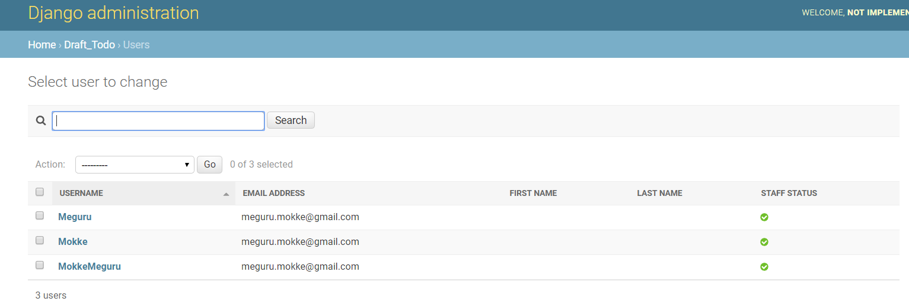
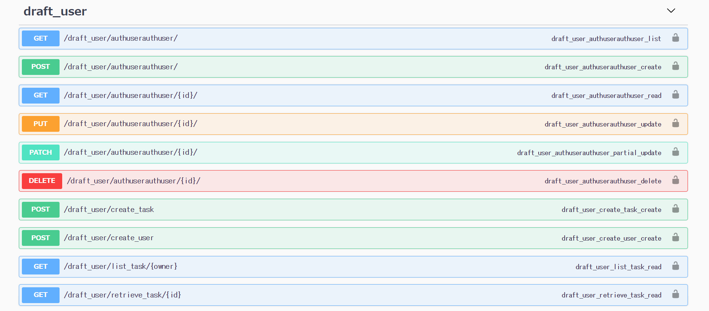

# Django REST Framework Tutorials 4
# Requirement
- Python > 3.6
- Mac or Linux (recommend)
- SQLite3

# Custom User を作る
## `models.py` が増えそうなのでフォルダにする
~~はじめからこうしておけよ~~

今後の課題を見る限り `models.py` がものすごく長くなりそうなので、フォルダにして分割します。

```shell
mkdir models
mv models.py models/todoItem.py
touch models/user.py
touch models/__init__.py
```

それぞれのファイルを次のようにします。

todoItem.py

```python
from django.db import models
from django.core.validators import MinLengthValidator
from .user import User

# Create your models here.
class TodoItem(models.Model):
    owner = models.ForeignKey(User,
                              on_delete=models.CASCADE)
    todo_name = models.CharField(max_length=100)
    todo_text = models.TextField(blank=True, null=True)
    dead_line = models.DateTimeField()
    raise_date = models.DateTimeField(auto_now_add=True)
    importance = models.IntegerField(null=True)
    close_date = models.DateTimeField(blank=True, null=True)

    def __str__(self):
        return "{}-{}".format(self.owner, self.todo_name)

    class Meta:
        ordering = ('dead_line', 'raise_date')
```

user.py

```python
from django.db import models
from django.core.validators import MinLengthValidator


# Create your models here.
class User(models.Model):
    nickname = models.CharField(max_length=30,
                                validators=[MinLengthValidator(5)],
                                unique=True,
                                primary_key=True)
    email = models.EmailField()

    def __str__(self):
        return "{}-{}".format(self.nickname, self.email)
```

あとは依存関係の解決ですが、こちらは頑張ってください。全部書くと見る気、なくなるでしょ？
## AuthUser クラスを作る
必要なクラスは、`UserManager` と `AuthUser` というクラスです。

`UserManager` はユーザ生成周りで必要になるクラスで、`AuthUser` はUserそのものの Model になります。
前者は View や Serializer の話では？と思うかもしれませんが、Djangoではこうなっているのでそう理解して下さい。

`AuthUser` で `UserManager` を `object` という変数に押し込めていますが、これが実質的に外部の View とやり取りをするために使われています。
適当な例をあげると、ある名前 `x` のユーザ情報がほしければ、`AuthUser.objects.get(username='x')` みたいにします。


`UserManager` では、一般ユーザの作成についての関数である `create_user` 、そしてスーパユーザの作成についての関数である `create_superuser` が宣言されています。

お気づきでしょうか？ `python manage.py createsuperuser` 、そうこれです。

`AuthUser` では、ユーザに関するいろいろなパラメータの設定をしています。基本となる `django.contrib.auth.models.AbstractUser` とほとんど変わっていない実装をしています。

変更点は

- ユーザ名を最低５文字以上にした。
- first name, last name を入力できないようにした

などです。

(本当はDBから消したかったのですが、それにはかなりのリファクタリングが必要なため諦めました)

おそらく本番環境などでは、権限付きユーザを消した上で、createsuperuser 関数などを修正して絶対に権限付きユーザが作られないようにするとかしたほうが良いと思います。（頑張ると一般ユーザから権限付きユーザへいけるの、怖くないんですかね？）

```python
from django.db import models
from django.contrib.auth.models import PermissionsMixin, AbstractBaseUser
from django.contrib.auth.validators import UnicodeUsernameValidator
from django.core.validators import MinLengthValidator
from django.utils import timezone
from django.utils.translation import gettext_lazy as _
from django.core.mail import send_mail
from django.contrib.auth.base_user import BaseUserManager


class UserManager(BaseUserManager):
    use_in_migrations = True

    def _create_user(self, username, email, password, **extra_fields):
        if not username:
            raise ValueError('Invalid Value: Please Input your User Name')
        email = self.normalize_email(email)
        username = self.model.normalize_username(username)
        user = self.model(username=username, email=email, **extra_fields)
        user.set_password(password)
        user.save(using=self._db)
        return user

    def create_user(self, username, email, password, **extra_fields):
        extra_fields.setdefault('is_staff', False)
        extra_fields.setdefault('is_superuser', False)
        return self._create_user(username, email, password, **extra_fields)

    def create_superuser(self, username, email, password, **extra_fields):
        extra_fields.setdefault('is_staff', True)
        extra_fields.setdefault('is_superuser', True)
        if extra_fields.get('is_staff') is not True:
            raise ValueError('Superuser must have is_staff=True.')
        if extra_fields.get('is_superuser', True) is not True:
            raise ValueError('Superuser must have is_superuser=True')
        return self._create_user(username, email, password, **extra_fields)


# id cannot be removed since Too complex framework dependencies
class AuthUser(AbstractBaseUser, PermissionsMixin):
    username_validator = UnicodeUsernameValidator()
    username = models.CharField(
        _('username'),
        max_length=30,
        unique=True,
        help_text=_('Required. Letters, digits and @/./+/-/_ only.'),
        validators=[username_validator,
                    MinLengthValidator(5)],
        error_messages={
            'unique': _("A user with that username already exists.")
        })
    email = models.EmailField(_('email address'), blank=False)
    is_staff = models.BooleanField(
        _('staff status'),
        default=False,
        help_text=_(
            'Designates whether the user can log into this admin site.'),
    )
    is_superuser = models.BooleanField(
        _('superuser status'),
        default=False,
        help_text=_(
            'Designates whether the user can log into this admin site.'),
    )
    last_login = models.EmailField(_('email address'), blank=True)
    is_active = models.BooleanField(
        _('active'),
        default=True,
        help_text=_('Designates whether this user should be treated as active.'
                    'Unselect this instead of deleting accounts.'))
    date_joined = models.DateTimeField(_('date joined'), default=timezone.now)

    objects = UserManager()

    first_name = models.CharField(default="", blank=True, max_length=1)
    last_name = models.CharField(default="", blank=True, max_length=1)

    EMAIL_FIELD = 'email'
    USERNAME_FIELD = 'username'
    REQUIRED_FIELDS = ['email', 'password']

    class Meta:
        verbose_name = _('user')
        verbose_name_plural = _('users')

    def clean(self):
        super().clean()
        self.email = self.__class__.objects.normalize_email(self.email)

    def get_full_name(self):
        return "Not Implemented"

    def get_short_name(self):
        return "Not Implemented"

    def email_user(self, subject, message, from_email=None, **kwargs):
        send_mail(subject, message, from_email, [self.email], **kwargs)
```

次に、`models.__init__.py` を編集します。これは後で出てくる `settings.py` でちょっとしたエラーを回避するためです。

```python
from .authUser import AuthUser
```

次に `draft_todo/admin.py` を編集します。

```python
from django.contrib import admin

# Register your models here.
from .models.user import User
from .models.todoItem import TodoItem
from .models.authUser import AuthUser
from django.contrib.auth.admin import UserAdmin

admin.site.register(User)
admin.site.register(TodoItem)
admin.site.register(AuthUser, UserAdmin)
```

`AuthUser` があまり変更できなかった理由の一つに、この `UserAdmin` に関連した field を削除できなかったことがあります。

最後に `settings.py` を編集します。

```python
# ...
INSTALLED_APPS = [
    'django.contrib.admin',
    'django.contrib.auth',
    'django.contrib.contenttypes',
    'django.contrib.sessions',
    'django.contrib.messages',
    'django.contrib.staticfiles',
    'livesync',
    'rest_framework',
    'drf_yasg',
    'draft_todo.apps.DraftTodoConfig',
]

AUTH_USER_MODEL = 'draft_todo.AuthUser'

# ...
```

`AUTH_USER_MODEL` に `AuthUser` を追加していますね。`draft_todo.AuthUser` 、つまり `<app_name>:<Model>`の形が大事です。これが`draft_todo.models.authUser.AuthUser'` であるとクソみたいなエラーが吐かれます。

## AuthUser クラスを掘る
次に AuthUser クラスを彫ります。

```shell
python manage.py makemigrations draft_todo
python manage.py migrate
python manage.py createsuperuser
```
## admin 画面で見る



確かに追加できることがわかりますね。
## Serializer を作る
`serializers.py` に次を追加します。

```python
# ...
from draft_todo.models.authUser import AuthUser

# ...
class TaskAuthUserSerializer(ModelSerializer):
    class Meta:
        model = AuthUser
        fields = ['username', 'email', 'password']
```

つまり `username` `email` `password` が必要になる、ということです。
## 仮の View を作る
`views.py` に次を追加します。

```python
# ...
from rest_framework.viewsets import ModelViewSet
from draft_todo.models.authUser import AuthUser
from draft_todo.serializers import TaskAuthUserSerializer

# ...
class TaskAuthUserAPIView(ModelViewSet):
    queryset = AuthUser.objects.all()
    serializer_class = TaskAuthUserSerializer
```

今回は適当に沢山の(セキュリティ的にガバガバすぎる下痢便のような)APIを大量に放り出します。
## URL に追加する
ちょっとだけ変化がありますが、今回はこれ以上は紹介しません。詳しくは DefaultRouter のドキュメントを見てください。

```python
# ...
from rest_framework import routers

# ...
router = routers.DefaultRouter()
router.register(r'authuser', dview.TaskAuthUserAPIView)

urlpatterns = [
    # ...
    path('draft_user/authuser',
         include(router.urls),
        name='da'),
]
```
## Swagger で確認する



出るわ出るわAPIの山

# Tips
## そもそもなんでユーザと管理ユーザが等じ場所にあるんや
システムメンテナンスには便利なんだろうけどわけわからん。
## 変な変数がある気がするんだけど
こいつらは abstract class にある値です。ネストが深いくせに重要な値ほど奥深くに眠っているので探すのがきっついっすね。
DBによってはパフォーマンスに影響しそうなんですけど、そのあたりはどうなんですかね。


