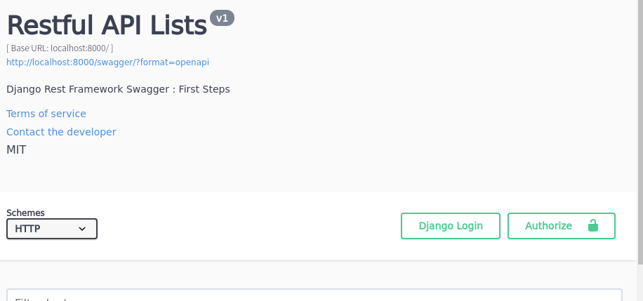

# Django REST Framework Tutorials 5
# Requirement
- Python > 3.6
- Mac or Linux (recommend)
- SQLite3

# AuthUser に紐付いたタスクを作る
前回幼児の食べ散らかしのようなゴミAPIを大量生産してしまったので、ここらへんでしっくりしたものを作ってみましょう。

設計方針は Tutorials 3 で作ったタスクと ユーザのそれに近いものを作る、というものです。

手順をぱっと考えると

- `AuthUser` に紐付いた `TaskTodoItemAsAuthUser` 関連クラスを作る
- ログインによる制限機能を実装する
    - ログインしているユーザのタスク生成API

の二本立てになります。

しかしまずは Swagger 上でのデバッグ方法について考えなければならないでしょう。ということで先んじてこちらか触れていきます。

# Swagger 上でのログイン確認



`Authorize` の文字が見えますね。これがログインをするための設定です。

押すとログイン画面が出てくるのでログインしてください。ログインすると、鍵が閉じます。


# AuthUser のログインが必要なAPIを作る
## Model を作る
脳死で `models/todoItemAsAuth.py` を作ります。

```python
from django.db import models
from .authUser import AuthUser


# Create your models here.
class TodoItemAsAuth(models.Model):
    owner = models.ForeignKey(AuthUser,
                              to_field='username',
                              on_delete=models.CASCADE)
    todo_name = models.CharField(max_length=100)
    todo_text = models.TextField(blank=True, null=True)
    dead_line = models.DateTimeField()
    raise_date = models.DateTimeField(auto_now_add=True)
    importance = models.IntegerField(null=True)
    close_date = models.DateTimeField(blank=True, null=True)

    def __str__(self):
        return "{}-{}".format(self.owner, self.todo_name)

    class Meta:
        ordering = ('dead_line', 'raise_date')
```

admin で確認できるようにするために `admin.py` も書き足します。

```python
# ...
from .models.todoItemAsAuth import TodoItemAsAuth

# ...
admin.site.register(TodoItemAsAuth)
admin.site.register(AuthUser, UserAdmin)
```
## Serializer を作る
こちらも何も考えずに書いています。唯一違うのは、`ReadOnlyField`  という謎の user があることですが、今は気にしないでください。

```python
# ...
from draft_todo.models.todoItemAsAuth import TodoItemAsAuth


# ...
class TaskAuthAsAuthUserCreateSerializer(ModelSerializer):
    user = serializers.ReadOnlyField(source='authuser.username')

    class Meta:
        model = TodoItemAsAuth
        fields = ['owner', 'todo_name', 'todo_text', 'dead_line']
```


## View を作る

```python
class TaskAuthUserCreateTodoItemAPIView(LoginRequiredMixin, CreateAPIView):
    queryset = TodoItemAsAuth.objects.all()
    serializer_class = TaskAuthAsAuthUserCreateSerializer

    def perform_create(self, serializer):
        serializer.save(owner=self.request.user)
```
LoginRequiredMixin については (公式)[https://docs.djangoproject.com/en/2.2/topics/auth/default/#django.contrib.auth.mixins.LoginRequiredMixin] を参考にしてください。

今回は、self.request.user にユーザの情報が用感じに含まれていること、それを用いて serializer が機能していうることがわかってもらえれば十分です。

(とはいえこれ、頑張れば偽装できそうな作りをしているので若干不安材料が残りますね。実際のところ、どうなんでしょう)

## URL を作る
`urls.py` を編集して下さい。

```python
urlpatterns = [
       # ...
       path('draft_authuser/create_task',
         dview.TaskAuthUserCreateTodoItemAPIView.as_view(),
        name='dact'),
]
```

## Swagger で確認する
Swagger で確認すると、たしかにログイン時にタスクが追加あできることがわかります。（）ログインしていないと、別の画面へ飛ばされます。これは `LoginRequiredMixin` の機能です。


 Admin で確認すると、確かに追加されていることがわかります。


今回はこんな感じで短めに終わりにしましょう。お疲れ様でした。
# Tips
## LoginRequiredMixin を関数っぽく書くとどうなるの？
(公式)[https://docs.djangoproject.com/en/2.2/topics/class-based-views/intro/#decorating-the-class] にあるように、`@method_decorator(login_required)` となります。
