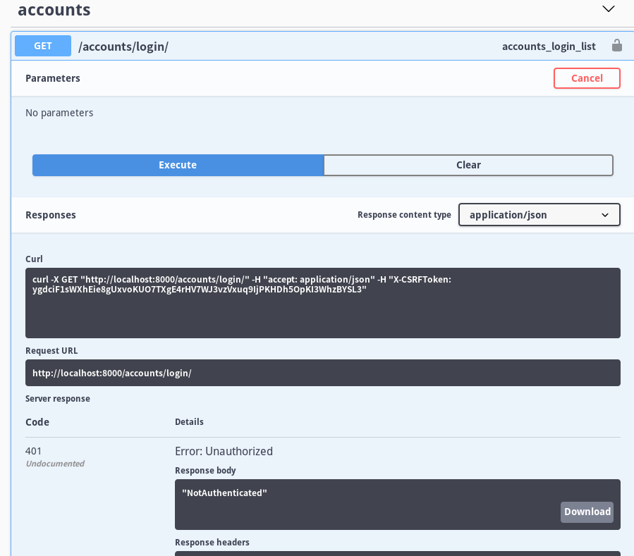

# Django REST Framework Tutorials 6
# Requirement
- Python > 3.6
- Mac or Linux (recommend)
- SQLite3

# ログイン処理周りの実装を行う
ログインを実装する簡単な方法は、そのためのライブラリを利用することです。下手に自分で実装しようとするとフレームワークを勉強しないといけないので、納期が短い場合なんかはこういう雑な方法で解決しないといけません。

```shell
pip install django-rest-auth
```

settings.py

```python:settings.py
# ...

INSTALLED_APPS = [
    'django.contrib.admin',
    'django.contrib.auth',
    'django.contrib.contenttypes',
    'django.contrib.sessions',
    'django.contrib.messages',
    'django.contrib.staticfiles',
    'livesync',
    'rest_framework',
    'drf_yasg',
    'draft_todo.apps.DraftTodoConfig',
    'rest_framework.authtoken'
]

#...
```

```python:urls.py
# ...
import rest_auth


# ...

urlpatterns = [
    # ...
    path('rest-auth', include('rest_auth.urls'))
]
```

```shell
python manage.py migrate
python manage.py runserver
```

# Swagger で確認してみる
作ってあるユーザでログインしてみましょう。


ユーザの情報を参照しましょう。


タスクを追加してみましょう。


ちなみにページをリロードすると、ログイン情報が更新されます。


# admin で確認してみる

admin から Tokens を確認してみましょう。


タスクが追加されているのかを確認してみましょう。


# `accounts/login` を実装する
ログインしていない状況でタスクを追加しようとしたらどうなるでしょう？ `LoginRequiredMixin` は簡単な解決策として `accounts/login` へページを遷移させようとします。

これは rest framework としては大変うれしくない仕様です。よってこれを上書きしましょう。

draft_todo/views.py
```python:draft_todo/views.py
# ...
from rest_framework.decorators import api_view
from rest_framework import status


# ...
@api_view(['GET'])
def not_authorized(request):
    return Response(status=status.HTTP_401_UNAUTHORIZED , data='NotAuthenticated')
```

urls.py
```python:urls.py
# ...

urlpatterns = [
    # ...
    path('accounts/login/', dview.not_authorized)
]
```

これは Get method で `accounts/login/` へアクセスがあったら、何がなんでも 401 コード(お前ログインできてねーよ)を返すAPIです。

ところでこいつは今までのAPIの書き方とは違って、何やら関数っぽいですよね。これは Django の View の書き方がもう一つ、関数ベースの定義方法です。~~これがあるからDjangoはチーム開発したくないんだ~~ 

@ api_view で、get メソッドの関数であることを示しています。後は関数なのでわかって下さい。そうでないならPythonに慣れていないかもしれないので、別言語を用いて RESTful API 開発して下さい。

Swagger で確認をすると、次のようになっています。



# Next Step？
とりあえずこれだけ動けば後は気持ちで解決できると思います。
なにか問題があればレポジトリの issue を立てて下さい。

# Tips
## 認証周りってどんな種類があるの？あとどれがおすすめ？
Django Rest Framework では [この一覧](https://www.django-rest-framework.org/api-guide/authentication/#basicauthentication) にある認証方法や、[django-rest-auth](https://django-rest-auth.readthedocs.io/en/latest/index.html) にあるような Social Authentication (Twitter 認証とか) があります。

個人的には Session Authentication が何も考えずに手に馴染んでいるので好きなんですが、クソジャイル開発とかしているとチームの火種となるので、Basic認証が楽なんじゃないっすかね。ただし当然のことながらHTTPS化が推奨なので、その点だけ気をつける必要がありそうですね。

(というか認証周り自体チーム開発の火種なのでは…?)

# backlog

この状態のデータは、このレポジトリの release v0.1.6 にあります。
